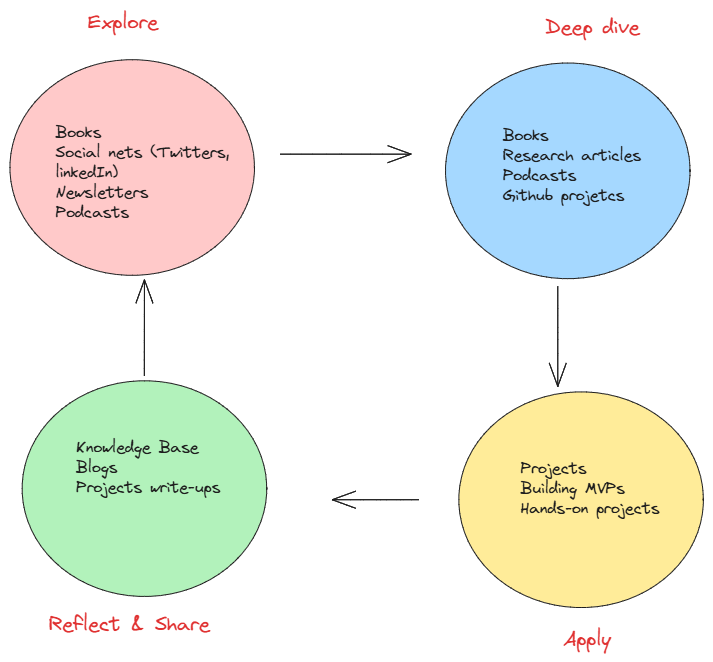

# The Art of Lifelong Learning & Technology Watch

> "Any fool can know. The point is to understand."  
> ― Albert Einstein

As engineers, lifelong learning is not optional—it is the foundation of our relevance in a fast-moving technological world. Over time, I’ve realized that **learning itself is a skill**: the better we master it, the more effective our growth becomes.

My strategy is built on a **four-phase cycle**: *Explore → Deep Dive → Apply → Reflect & Share*.

---

## 🔍 1. Explore – Curate & Discover

I expose myself to a wide range of sources to identify trends and broaden my perspective:

- **Books & Newsletters** → daily reading (40 min/day) with a curated monthly list that mixes AI/embedded systems and unrelated fields (history, biology, animals…) to spark creativity.
- **Social Media** → following top researchers and engineers on Twitter/X, LinkedIn, and niche communities on Reddit.
- **News Aggregators** → Feedly to centralize and streamline my watch.

---

## 2. Deep Dive – Structured Knowledge

From exploration, I selectively dive deeper into high-value content:

- **Research Papers** (arXiv, IEEE, recommendations from social feeds).
- **Podcasts** during cooking/exercise, focusing on AI, IoT, and innovation.
- **GitHub Projects** to see real-world implementations and trending open-source work.

---

## 3. Apply – Learn by Building

Knowledge without practice has little impact. I reinforce learning by:

- Developing **prototypes, MVPs, and small projects** using my personal tech stack.
- Experimenting with new frameworks, tools, or models to translate theory into working solutions.
- Treating each project as a **mini-R&D cycle** to sharpen both engineering and innovation skills.

---

## 4. Reflect & Share – Turn Learning into Assets

To ensure retention and create value beyond myself:

- I maintain a **personal knowledge base** (Notion) where I log insights, frameworks, and lessons learned.
- I **share summaries, project write-ups, or reflections** on my blog.
- This reflection loop multiplies the impact of my learning by making it visible, reusable, and open to feedback.

---

## 5. Measuring Progress – Stay Accountable

I evaluate my growth through simple, trackable metrics:

- Books read per quarter.
- Research papers deeply studied vs skimmed.
- Number of prototypes or MVPs built.
- Knowledge base entries added monthly.